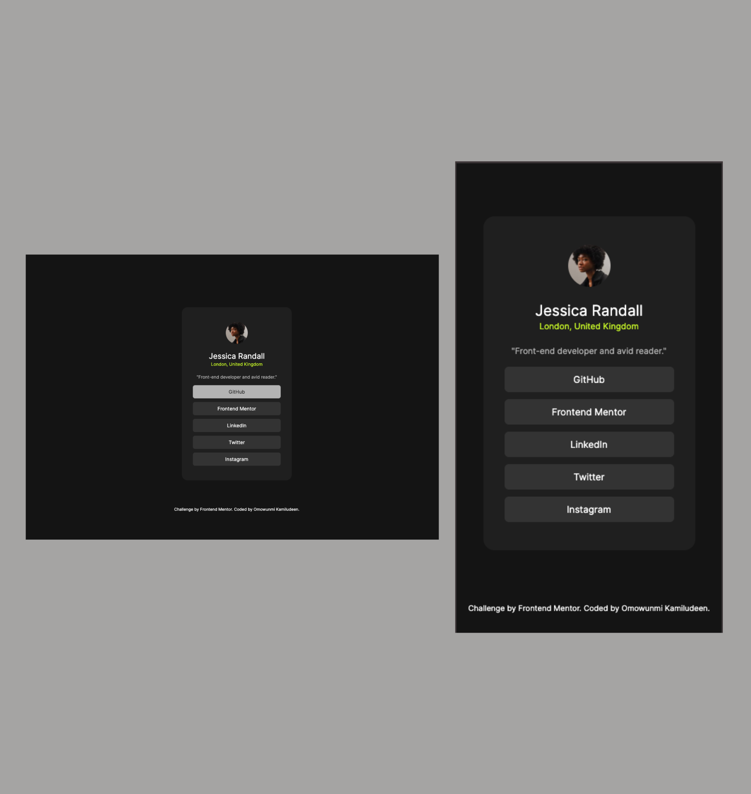

# Frontend Mentor - Social links profile solution

## Table of contents

- [Overview](#overview)
  - [Screenshot](#screenshot)
  - [Links](#links)
- [My process](#my-process)
  - [Built with](#built-with)
  - [What I learned](#what-i-learned)
  - [Continued development](#continued-development)
- [Author](#author)
- [Acknowledgments](#acknowledgments)

## Overview

### Screenshot




### Links

- Solution URL: [Check out my solution](https://www.frontendmentor.io/solutions/component-article-button-and-responsive-mobile-design-DbT1zZpkW6)
- Live Site URL: [Check out my live site](https://omowunmikamil.github.io/recipe_page.github.io/)

## My process

### Built with

- Semantic HTML5 markup
- CSS custom properties
- Mobile-first workflow (Mobile Responsiveness)

### What I learned

```html
<h1>Some HTML code I'm proud of</h1>
<p></p>
<apan></apan>
<lmg/>
<main></main>
<section></section>
<article></article>
<button></button>
```
```css
.component {
  width: 300px;
  padding-top: 20px;
  padding-bottom: 30px;
  margin: 10% auto 5%;
  background-color: hsl(0, 0%, 12%);
  border-radius: 16px;
}

.header, article {
  text-align: center;
}

img {
  width: 60px;
  border-radius: 60px;
  margin-top: 20px;
  margin-bottom: 10px;
}

span {
  color: hsl(75, 94%, 57%);
  font-size: 12px;
}

button {
  background-color: hsl(0, 0%, 20%);
  width: 80%;
  border: none;
  border-radius: 6px;
  padding: 10px;
  margin-bottom: 10px;
  color: hsl(0, 0%, 100%);
}

button:hover {
  background-color: hsl(0, 0%, 70%);
  color: hsl(0, 0%, 12%);
}

/* Mobile */
@media screen and (max-width: 375px) {
  .component {
    margin: 20% auto;
  }
}
```

### Continued development

I need to study more on CSS pseudo-class selector for better knowledge and understanding.

## Author

- Website - [Visit my Portfolio Website](https://omowunmikamil.tech)
- Frontend Mentor - [Omowunmi Kamiludeen](https://www.frontendmentor.io/profile/Omowunmikamil)
- Twitter - [Browser_Nerd](https://www.twitter.com/@Browser_Nerd)

## Acknowledgments

Frontend Mentor - for making this challenge possible.